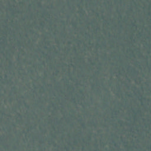
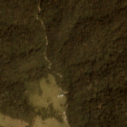

# Amazon Classifier

This project collects my work on the **Planet: Understanding the Amazon from Space** [Kaggle challenge](https://www.kaggle.com/c/planet-understanding-the-amazon-from-space).

The goal is to develop an algorithm that can classify satellite images of the Amazon basin.

The categories are not exclusive - for example an image might be classified as ['haze', 'primary', 'water']

| haze primary                    | clear agriculture primary water | clear agriculture primary habitation road |
|--------------------------------|---------------------------------|------------------------------------------|
|| |          |

## Usage

Dependencies are listed in `environment.yml` and can be installed using [conda](https://conda.io/docs/index.html)

      $ conda env create -f environment.yml

A collection of my notes and exploratory analyses can be found in the `exploration.ipynb` jupyter notebook

## Preliminary Results

### Approach 1 - Random Forest

Although this challenge, which involves image classification, presented a classic use-case for deep learning, I wanted to first explore a more traditional machine learning approach. Why you might ask? Mostly because I wanted to try something different and because satellite images are unique in a way that make this task different than the traditional car/no-car or cat/dog image classification problems. Unlike in the cat/dog problem where the animals can come in a huge variety of sizes, colors, textures, etc., there are relatively simple image patterns and colors the correlate with different weather and land categories. For example, clouds are always white-ish. That made me think that I might be able to engineer some "features" that a traditional machine learning algorithm could use to learn the different image classes.

The short summary is that this didn't work very well. I constructed some features, including the distribution of intensities in each color channel and the spatial autocorrelation, and then fed them into a random forest classifier. See `exploration.ipynb` for an explanation of the features and `rf_model.py` for training the random forest model. You can run the training and evaluation yourself with:

      $ python rf_model.py

The result is a lowsy f2 score of ~0.75

### Approach 2 - Deep Convolutional Network

The first approach didn't perform very well, but it did make me realize that convolutional networks don't capture all of the information content in an image. Maybe that's obvious and a good thing in many ways, but there can be relevant information that the network has no way to encode. In this case, I'm thinking about the distributions of channel intensities which I found had a distinct shape for different labels. A conv-net can only encode the mean channel values, not the full shape of the distributions.

That being said, this approach has worked much better, although it's still a work in progress.

I decided to start with a pre-trained model, i.e. transfer learning. In this case I used the [VGG16 model](https://arxiv.org/pdf/1409.1556.pdf) trained on ImageNet. This was also the first time that I used [Keras](https://keras.io/) rather than [TensorFlow](https://www.tensorflow.org/). For quickly setting up and training a model, this is definitely the way to go.

Using a pre-trained model makes sense because many of the lower layers contain very generic kernels; it's only the top layers that really contain information about complex features. So I exchanged the top dense layer from the original model with an untrained dense layer and only trained that layer on the these data. The drawback to using a pre-trained model is that it constrains the input data. The VGG16 model I used was trained on ImageNet images which are 8-bit, 3-channel images. The satellite images are 16-bit 4-channel images. So for this initial test, I only used the RGB channels and I rescaled the intensities the [0, 255] range of 8-bit pixels. Training has been excruciatingly slow - like 12 hours per epoch slow on my laptop's CPU. One of the next steps is to get this running on a GPU. But the f2 score is now ~0.83 after only 2 training epochs with much room to improve.

To run the training:

      $ python cnn_model.py

### Next Steps

1.  Train on a GPU. My laptop's GPU is not CUDA enabled, so I'll have to pay for some AWS time.
2.  Balance the training data by augmenting the poorly represented classes, like `artisanal mine`, and possibly cull some of the over represented classes, like `primary`.
3.  Figure out how to use all 4 channels. Maybe duplicate the pre-trained weights from one of the RGB channels?
