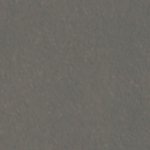
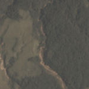
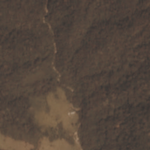

# Amazon Classifier

This project collects my work on the **Planet: Understanding the Amazon from Space** [Kaggle challenge](https://www.kaggle.com/c/planet-understanding-the-amazon-from-space).

The goal is to develop an algorithm that can classify satellite images of the Amazon basin.

The categories are not exclusive - for example an image might be classified as ['haze', 'primary', 'water']

| haze primary                    | clear agriculture primary water | clear agriculture primary habitation road |
|--------------------------------|---------------------------------|------------------------------------------|
|| |          |

## Usage

Dependencies are listed in `environment.yml` and can be installed using [conda](https://conda.io/docs/index.html)

      $ conda env create -f environment.yml

A collection of my notes and exploratory analyses can be found in the `exploration.ipynb` jupyter notebook
